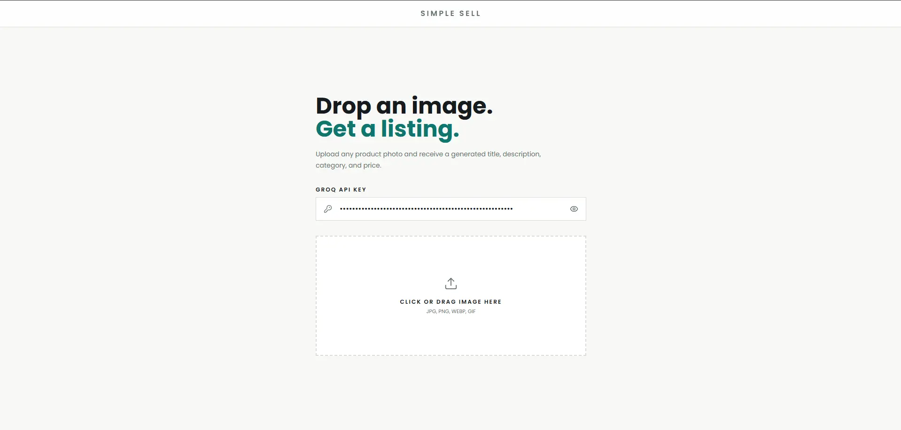

Simple-sell is a listing generator tool for AI. They were simple: Take a photo of the item and create a polished reselling listing complete with title, description, price, and category.

I began by focusing on the core AI. I first played around with the gemini-2.5-flash model, and relied on Pydantic models to dictate specific output structures instead of just raw text responses. After successfully standardizing response shape, I began work on an eval pipeline with a set of 30 images, representing realistic goods within the market context.

But the evaluatoins ran into Gemini's timeout and then I decided to shift to Llama-4-Scout-17B-16E-Instruct which offered predictable answers quickly. With Instructor + Pydantic, we can service the output of the AI agent in a reliable typed data.

I took the AI service and wrapped it in FastAPI. So essentially the backend will expose an image uploading API, that will output the generated listing. Then, the front end was developed in React, TypeScript, Vite and Tailwind CSS so that people are able to upload an image and see the result.

The project was completed with the backend in a container using Docker, which then I deployed on Hugging Face Spaces. Frontend deployed on Netlify.

Live: https://simplesell.wilyde.com/
